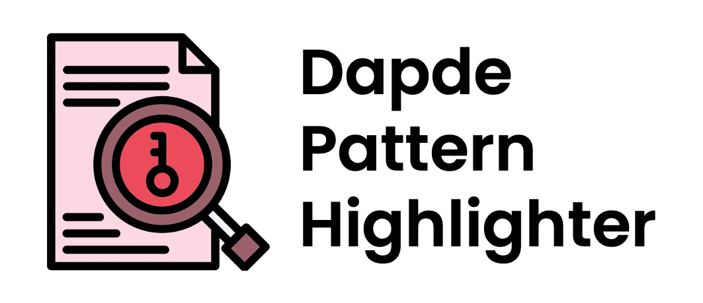
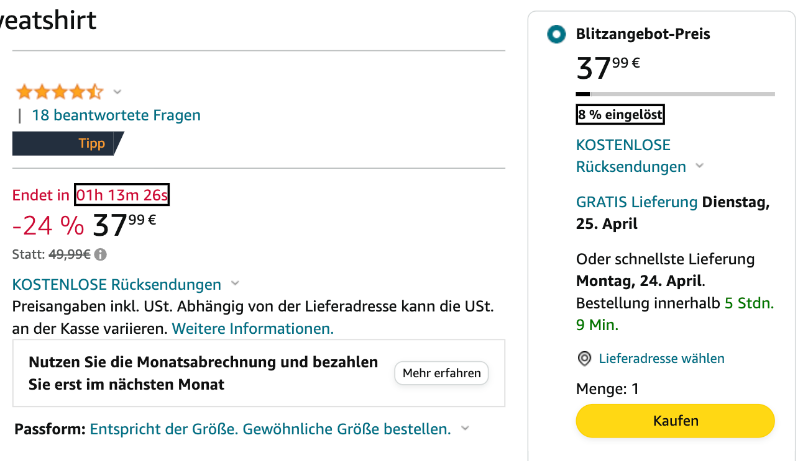
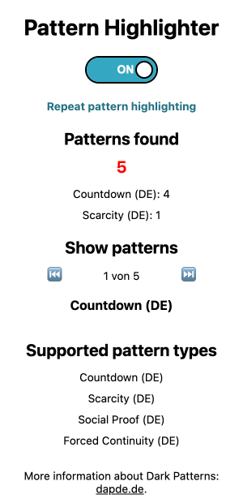

# Dapde Pattern Highlighter Browser Extension
This tool, developed by the informatics part of the [dapde-project](https://dapde.de/), is intended to help consumers to navigate the internet in a way similar to an ad blocker. However, the highlighter differs from ad blockers in one crucial aspect: it does not block individual dark patterns on websites but highlights them so that consumers become aware of the influences affecting them. In addition, the tool informs about the type of pattern.

## Contents
- [Features](#features)
- [Video and Screenshots](#video-and-screenshots)
- [How it works](#how-it-works)
- [Browser Compatibility](#browser-compatibility)
- [Installation](#installation)
- [Libraries Used](#libraries-used)
- [License](#license)
- [About Dapde](#about-dapde)

## Features
- Automatic detection of dark patterns on web pages
- Highlighting of suspicious elements with minimal impact on page appearance
- Popup window providing information on detected dark patterns, including their category and an explanation
- No blocking of web page content
- Extension icon displaying number of detected dark patterns
- Function to individually highlight each detected dark pattern
- Supporting multiple languages (currently English and German available)

## Video and Screenshots
### Teaser Video
Click on the image or [here](https://dapde.de/en/news-en/dapde-dark-pattern-highlighter-en/) to watch the teaser video for the Pattern Highlighter.

### Screenshots
|                                                                                                                                                                                  |                                                                                                                                                                            |
| :-------------------------------------------------------------------------------------------------------------------------------------------------------------------------------------------------------------------------: | :----------------------------------------------------------------------------------------------------------------------------------------------------------------------------------------------------------------------: |
| *Example of a web site with two highlighted dark patterns. The black border highlights a countdown and a scarcity pattern element (from left to right). \*Some web site details were manually removed from the screenshot.* | *The popup window of the extension. The popup window can be used to disable and enable the highlighting. Additionally, information about the detected patterns is displayed and each one can be highlighted separately.* |

## How it works
The Pattern Highlighter works entirely locally in the browser and does not connect to any servers. When visiting a web page, the extension injects a small script that creates an internal temporary copy of the entire web page i.e. its HTML DOM. After a short pause (about 1.5 seconds) a second copy is created. Subsequently, all elements of these copies are examined individually and in combination with child elements using the implemented pattern detection methods. The pattern detection methods decide whether an element is a specific dark pattern or not. The reason for creating two copies with a time gap is to detect changes on the web page. This makes it possible to detect certain patterns such as countdowns.

Mainly responsible for the results of the pattern detection are the mentioned detection functions. These are centrally defined in the `patternConfig` object together with information about the associated patterns in [`constants.js`](chrome/scripts/constants.js). This `patternConfig` object can be extended arbitrarily by additional patterns and functions, according to the requirements that are commented in [`constants.js`](chrome/scripts/constants.js).

Currently, one detection function each is implemented for the four following patterns.
- [Countdown](https://dapde.de/en/dark-patterns-en/types-and-examples-en/druck2-en/)
- [Scarcity](https://dapde.de/en/dark-patterns-en/types-and-examples-en/druck2-en/)
- [Social Proof](https://dapde.de/en/dark-patterns-en/types-and-examples-en/druck2-en/)
- [Forced Continuity](https://dapde.de/en/dark-patterns-en/types-and-examples-en/operativer-zwang2-en/)

Right now, all of the four detection functions are optimized for German and English websites and cannot be applied to websites in other languages.

## Browser Compatibility
| Browser         	| Is compatible? 	| Tested versions                                                               	|
|-----------------	|:--------------:	|-------------------------------------------------------------------------------	|
|  Google Chrome   	|        ✅       	| <ul><li>113.0.5672.92 (Mac/arm64)</li><li>113.0.5672.93 (Win/x64)</li></ul> 	|
|  Microsoft Edge  	|        ✅       	| <ul><li>113.0.1774.35 (Mac/arm64)</li><li>113.0.1774.35 (Win/x64)</li></ul>   	|
|  Safari          	|        ✅       	| <ul><li>16.4 (18615.1.26.110.1) (Mac/arm64)</ul></li>                            	|
|  Mozilla Firefox 	|        ✅       	| <ul><li>113.0 (Mac/arm64)</li><li>112.0.2 (Win/x64)</li></ul>   	|
|  Opera           	|        ✅       	| <ul><li>98.0.4759.39 (Mac/arm64)</li><li>98.0.4759.39 (Win/x64)</ul></li>       	|

### Google Chrome, Microsoft Edge and Opera
The Pattern Highlighter uses an [API](https://developer.chrome.com/docs/extensions/reference/) that is specified by Google and primarily supported by the Google Chrome browser. However, many other browsers also support this Chrome API. Since Microsoft Edge and Opera, just like Google Chrome, are built on the [Chromium](https://en.wikipedia.org/wiki/Chromium_(web_browser)) code base, the [API support](https://developer.mozilla.org/en-US/docs/Mozilla/Add-ons/WebExtensions/Browser_support_for_JavaScript_APIs) of the three browsers is almost completely identical. Consequently, the extension will behave the same way in these browsers. This is also to be expected for other browsers that are based on Chromium.

### Firefox
Firefox also supports the Chrome API with [some differences and limitations](https://developer.mozilla.org/en-US/docs/Mozilla/Add-ons/WebExtensions/Chrome_incompatibilities). For the Pattern Highlighter it is only relevant that Firefox [does not support](https://developer.mozilla.org/en-US/docs/Mozilla/Add-ons/WebExtensions/manifest.json#browser_compatibility) the `background.service_worker` key in the [manifest file](https://developer.mozilla.org/en-US/docs/Mozilla/Add-ons/WebExtensions/manifest.json) of extensions to define scripts that run in the background. Instead, it supports the `background.scripts` key, which is not supported by Chrome. Therefore, the Firefox version of the extension requires a custom manifest file. The other files are the same as in the Chrome version of the extension. The section on [installation in Firefox](#firefox) explains how to create the Firefox version.

### Safari
Safari also supports the Chrome API functions required by the Pattern Highlighter. Thus, the Pattern Highlighter is functionally fully compatible with Safari. However, Safari uses its own format for extensions, which differs from the other browsers. Therefore, the code of the Pattern Highlighter must first be converted to a Safari extension. This can conveniently be done automatically and is described in the section on [installation in Safari](#safari-1).

Visual differences from the versions of the other browsers:
- *The number of detected patterns on the icon are always displayed with a red background, even if `0` patterns were detected.* Safari does [not support](https://developer.mozilla.org/en-US/docs/Mozilla/Add-ons/WebExtensions/API/action/setBadgeBackgroundColor) functions to change the background color of the text or these functions have [no effect](https://developer.mozilla.org/en-US/docs/Mozilla/Add-ons/WebExtensions/API/action/setBadgeBackgroundColor). By default, the text in Safari has a red background.
- *The icon of the extension is monochrome in the address bar.* If the extension is not active in the current tab, the icon is colored gray. If the extension has access to the web page in the current tab and is therefore active, the icon is colored in the accent color of the system (blue by default). This has nothing to do with the extension's internal activation status. If the user deactivates the extension in a single tab via the popup, the icon remains colored in the accent color.

## Installation
To install the extension, the repository or the `chrome` folder must be downloaded. Since the extension is not loaded from the stores of the browser providers, it must be installed in the developer mode of the browsers. For this, the individual steps for the different tested browsers are listed below.

### Chrome
1. Go to the Extensions page by entering `chrome://extensions` in a new tab.
   - Alternatively, click on the Extensions menu puzzle button and select **Manage Extensions** at the bottom of the menu.
   - Or, click the Chrome menu, hover over **More Tools**, then select **Extensions**.
2. Enable Developer Mode by clicking the toggle switch next to **Developer mode**.
3. Click the **Load unpacked** button and select the `chrome` directory.
4. (Optional): Click the Extensions menu puzzle button in the address bar and then click the **Pin** button next to the *Pattern Highlighter* to keep its icon permanently displayed.

### Edge
1. Go to the Extensions page by entering `edge://extensions` in a new tab.
   - Alternatively, click the **Settings and more (...)** button, select **Extensions** and click **Manage extensions** on the opened popup.
2. Enable Developer Mode by clicking the toggle switch next to **Developer mode**.
3. Click the **Load unpacked** button and select the `chrome` directory.
4. (Optional): Click the Extensions menu puzzle button in the address bar and then click the **Show in Toolbar** button (eye icon) next to the *Pattern Highlighter* to keep its icon permanently displayed.

### Safari
In order to install the extension in Safari, it must first be converted into the compatible format. This requires an Xcode installation. To convert the Pattern Highlighter to a Safari extension, follow these steps.

1. Open a terminal window and navigate to the path of the repository (one directory level above the `chrome` folder).
2. Execute the following command: `xcrun safari-web-extension-converter --macos-only --project-location safari chrome`. ([More information about the command.](https://developer.apple.com/documentation/safariservices/safari_web_extensions/converting_a_web_extension_for_safari#3586260))
3. The command should have created a new folder named `safari` containing the Xcode project for extension. Also, a Xcode window should have opened. In Xcode, click the Run button, or choose **Product** > **Run** to build and run your app.
4. Now the developer menu in Safari has to be activated and unsigned extensions have to be allowed. After that, the extension can be activated in the browser. The necessary steps are explained [here](https://developer.apple.com/documentation/safariservices/safari_web_extensions/running_your_safari_web_extension#3744467).

### Firefox
#### Building the Firefox version
To build the firefox version, the complete repository must be downloaded.

##### Windows
1. Execute the `create_firefox_from_chrome.bat` batch script in the root directory of the repository, by double-clicking the file.
   - Alternatively, open `cmd.exe`, navigate to the root directory of the repository and execute the batch script from the command line.
2. The `firefox` folder should now contain not only the `manifest.json` file but also all other files and folders from the `chrome` folder.

##### Mac
1. Open a new terminal window, navigate to the root directory of the repository and execute the `create_firefox_from_chrome.sh` shell script.
   - To do so, execute the following command: `sh create_firefox_from_chrome.sh`.
2. The `firefox` folder should now contain not only the `manifest.json` file but also all other files and folders from the `chrome` folder.

#### Installation
1. Go to the Firefox Debugging page by entering `about:debugging` in a new tab.
2. Click the **This Firefox** button on the left side, then click the **Load Temporary Add-on...** button and select the `manifest.json` file in the `firefox` directory.
3. Go to the Extensions page by entering `about:addons` in a new tab.
4. Click the **Extensions** button on the left side and then click on the *Pattern Highlighter*.
5. Open the **Permissions** tab and click the toggle switch to the right of `Access your data for all websites` to give the Pattern Highlighter permissions to scan for patterns on all websites.
6. (Optional): Click the Extensions menu puzzle button in the address bar, right-click on the *Pattern Highlighter* and then click **Pin to Toolbar** to keep its icon permanently displayed.

Since the extension can currently only be installed via the method for developers, in Firefox it only remains installed until the browser is restarted.

### Opera
1. Go to the Extensions page by entering `opera://extensions` in a new tab (or use the <kbd>Cmd</kbd>/<kbd>Ctrl</kbd> + <kbd>Shift</kbd> + <kbd>E</kbd> shortcut).
2. Enable Developer Mode by clicking the toggle switch next to **Developer mode**.
3. Click the **Load unpacked** button and select the `chrome` directory.
4. (Optional): Click the Extensions menu cube button in the address bar and then click the **Pin** button next to the *Pattern Highlighter* to keep its icon permanently displayed.

## Libraries Used
- [Lit 2.7.2](https://lit.dev/) ([BSD-3-Clause](chrome/scripts/lit/LICENSE))

## License
[MIT](LICENSE)

## About Dapde
The Dark Pattern Detection Project (Dapde) examines the manipulation of consumers in a digital environment through "dark patterns".

### Dark Patterns
Dark patterns are design patterns that lead users to act in a certain way that is contrary to their interests, exploiting design power unilaterally in the interests of their creator.

### The Project
Dapde is a joint project between the Institute of Computer Science at Heidelberg University and the German Research Institute for Public Administration in Speyer (FÖV). The Informatics Section tackles the challenge of recognizing dark patterns in online interactions with the aim of warning users of dangers early on. The Law Section develops legal answers to the challenges of steering consumers through dark patterns.

### Dapde Website
More information about our project and dark patterns can be found on our [website](https://dapde.de/).
